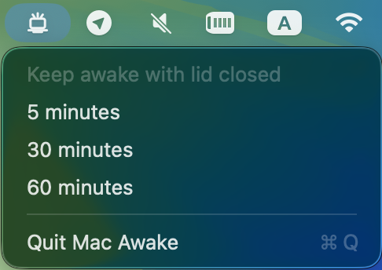

# Mac Awake

Mac Awake is a small macOS menu bar app that keeps your Mac awake with the lid closed for a fixed short timer: 5, 30, or 60 minutes.



## Use

1. Open Mac Awake.
2. Choose `5 minutes`, `30 minutes`, or `60 minutes` from the menu bar.
3. Click the active duration again to cancel early.
4. Quit Mac Awake to restore normal sleep behavior before exit.

## Installation

No signed release is available yet. Install from source with:

```sh
curl -fsSL https://raw.githubusercontent.com/alexanderkreidich/mac-awake/main/scripts/install.sh | /bin/bash
```

This builds Mac Awake, installs `MacAwake.app` in `/Applications`, installs the development helper, configures the installed app to open at login for your user account, and opens it. After installation, you can also launch Mac Awake from Applications or Launchpad. It requires Xcode and an administrator password.

## Uninstallation

To uninstall Mac Awake and restore normal sleep behavior:

```sh
launchctl bootout "gui/$UID/com.sasha.MacAwake.LoginAgent" 2>/dev/null || true
pkill -x MacAwake 2>/dev/null || true
sudo pmset -a disablesleep 0
sudo launchctl bootout "system/com.sasha.MacAwakeHelper" 2>/dev/null || true
rm -f "$HOME/Library/LaunchAgents/com.sasha.MacAwake.LoginAgent.plist"
sudo rm -rf "/Applications/MacAwake.app" "/Library/PrivilegedHelperTools/com.sasha.MacAwakeHelper" "/Library/LaunchDaemons/com.sasha.MacAwakeHelper.plist" "/Library/Application Support/Mac Awake"
```

## Safety

Keeping a closed Mac awake can trap heat and drain battery. Use Mac Awake only when the Mac has ventilation and enough power.

If normal sleep is not restored, run:

```sh
sudo pmset -a disablesleep 0
```
